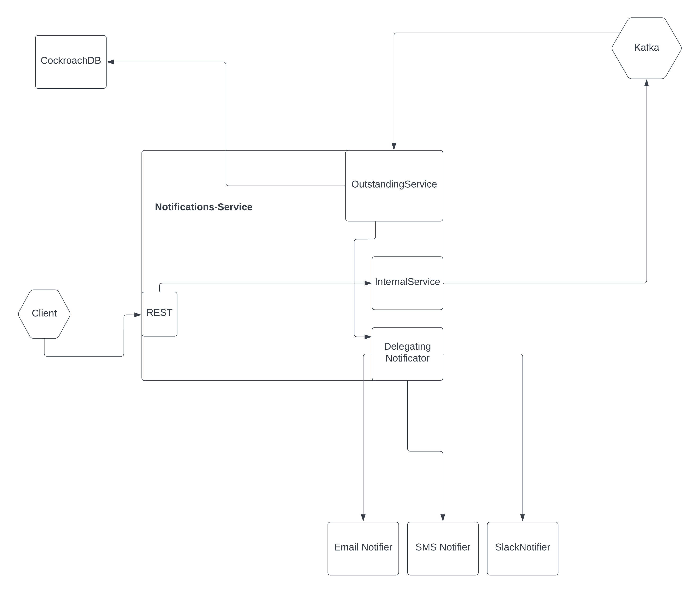

## Notifications-service

#### This service pushes notifications to SMS/Slack/Email providers

Requirements:

```
docker
go
golangci-lint
ginkgo for testing 
```

#### Ginkgo for testing
```
go install github.com/onsi/ginkgo/v2/ginkgo
```

#### How to run:
```
make run-local
```

#### Run integrations:
```
make run-local
make integration-tests
```

#### Run unit tests:
```
make unit-tests
```

#### Run local load env (WIP):
```
make run-load
```
head to  ./load/main.go and choose number of notifications and go routines to push 


#### Request to try the notifications service:
```
curl -X POST -H "Content-Type: application/json" \
    -d '{"txt": "Kole Poluchi li", "destination": "EMAIL", "uuid": "8f58c11d-ebc2-4ca7-a934-226e2bb6192c"}' \
    http://localhost:8091/notification
```

#### Points to improve further:

1. Refactor more, extract and reuse!
2. More more more more testing!!!!! I've written a few integrations, and a few unit tests, but generally will try to achieve close to 85%+ coverage
3. Add metrics, tracing (Prometheus/Jaeger)
4. Find Kafka Client that can do batched reads, start batching to DB! (that's a good performance improvement) (Or just batch yourself)
5. Load tests (We have to keep client's SLA agreement) (Currently there is some kind of load test suite, but is VERY basic, in a real application i'd go with some serious firepower and a load test environment!)
6. Correctness tests (Simulate failures by using multiple instances.) (Chaos testing), even better would be a nightly environment + chaos monkey

#### Deployment

1. Perfect deployment would be both Kafka and CockroachDB in the same K8s cluster for even lower latency/more throughput to not jump on the network
2. Machines with high CPU for the app (more go routines to feed from/to Kafka)

### Architectural diagram



##### Main ideas and thoughts about the architecture, stack choices


**CockroachDB** is used because of its scalability and being able to use it in a multi cloud environment.
**Kafka** pretty much the fastest messaging.

**CockroachDB's** great choice here, since single row operations are extremely fast and scalable because by adding new nodes we get more and more Multi Raft groups that can handle those rows.

Architectural diagram explanation

First of all to achieve Exactly Once End to End we need all parts of our system to be idempotent
We have the assumption that all notification providers (SMS, Email, Slack) have inbuilt deduplication based on an uuid. So posting a notification > 1 times will result in one push to the user (this has to be discussed with the relevant teams!!!! (Mobile/Web/etc)) 


#### Flow of messages

1. Let's say that the Client is a Web/Mobile which has an inbuilt **retry mechanism** for posting to **/notifications** (Client generates UUID, so we can dedupe on it)
2. We immediately after getting a notification we push it to **received-notifications** topic
3. We read from **received-notifications** topic and we persist the notifications in the database
4. We push a new message to **outstanding-notifications** to finally send the notification
5. We read from **"outstanding-notifications"** topic, we acquire **FOR UPDATE** lock on the DB row, we push the notification to the particular provider and change status to **PROCESSED**, we commit the DB and finally commit the msg.

#### Performance

The design choice to go with Client->Send to Kafka->Read Kafka->DB->Read Kafka->DB rather than Client->DB->Send Kafka->DB flow is the following:

Since we can do offline processing on the notifications, we can trade eventual convergence of the system for super low latency and extreme throughput
The application will eventually send all notifications, but the producer of the notifications (Client) will have super low latency.
On my 64GB/16 core machine, running the load-test containers + load main.go I get around 70K/notifications per second on the RECEIVING side, and around 4-5-6K/sec processing them.

Extremely scalable. By adding more CockroachDB nodes/Kafka nodes you can scale in a LOT. A limitation would be amount of transactions you can open.
However there is a way to fix that as well, batching kafka reads + batching Gets/Inserts to DB will scale the throughput immensely. See Points To Improve (**4**)

